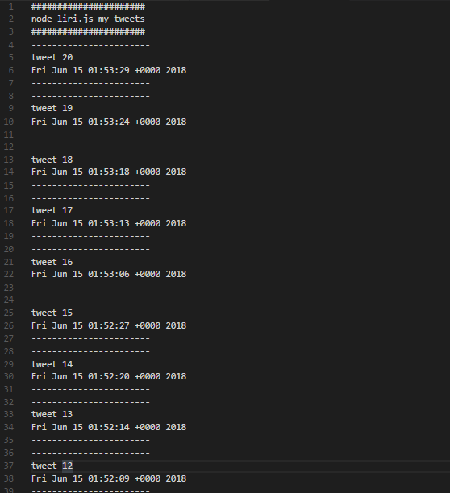
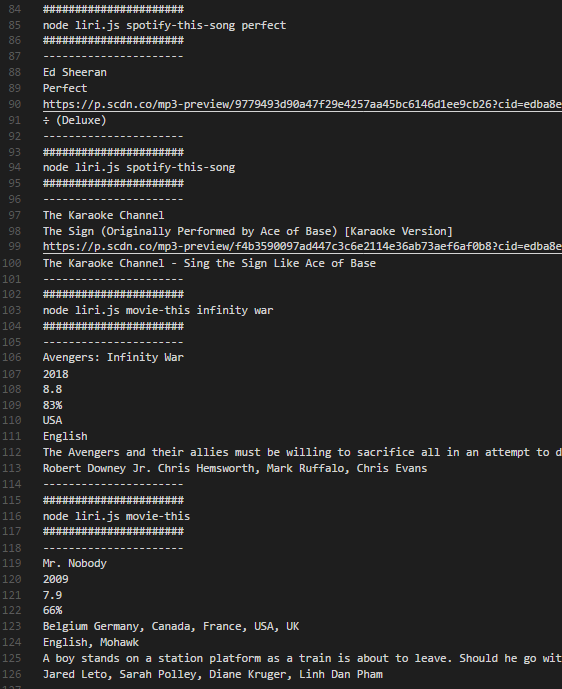

# liri-node-app
LIRI is like iPhone's SIRI.  LIRI is a Language Interpretation and Recognition Interface by using command line and gives back data.

(1)my-tweets;
(2)spotify-this-song;
(3)movie-this;
(4)do-what-it-says;

Getting Started

Step 1) Clone down repo.

Step 2) Run command 'npm install' in Terminal or GitBash

Step 3) Run command 'node liri.js' or one of the commands below.

Tech used

Twitter NPM Package - https://www.npmjs.com/package/twitter;

Spotify NPM Package - https://www.npmjs.com/package/spotify;

Request NPM Package - https://www.npmjs.com/package/request; 

